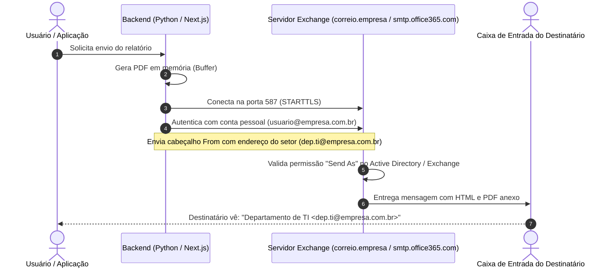

# 📬 Guia Definitivo: Integração de E-mail Corporativo (Outlook / Exchange / M365)

Este guia documenta o passo a passo completo, do zero à produção, para conectar qualquer aplicação web ao ecossistema de e-mails da Microsoft (**Microsoft 365 / Exchange Server On-Premises / Outlook Corporativo**).

O foco deste material abrange:
- Disparo de e-mails em formato HTML corporativo.
- Envio de anexos binários em memória (ex: PDFs gerados dinamicamente).
- O padrão **"Enviar Como" (Send As / Envio Delegado)**: autenticar com uma conta pessoal/serviço e enviar em nome de um setor (ex: `dep.ti@brasfort.com.br`).
- Exemplos funcionais em **Python** e **Node.js / Next.js / React**.

---

## 🧭 1. Arquitetura e Conceitos Fundamentais

Antes de escrever código, é essencial compreender como o Microsoft Exchange processa e-mails enviados por aplicações.

### 1.1. Topologia de Envio (Fluxo SMTP)



### 1.2. Servidores e Portas

| Tipo de Ambiente | Endereço do Servidor | Porta | Protocolo de Segurança | Quando utilizar? |
| :--- | :--- | :--- | :--- | :--- |
| **Exchange Local / Híbrido** | `correio.empresa.com.br` | **587** | **STARTTLS** (Recomendado) | Servidor On-Premises ou híbrido na rede interna corporativa. |
| **Exchange Local (Interno)** | `correio.empresa.com.br` | **25** | Plain / STARTTLS opcional | Relay liberado por IP dentro da rede sem exigência de login. |
| **Microsoft 365 Cloud** | `smtp.office365.com` | **587** | **STARTTLS** | Contas que residem 100% na nuvem da Microsoft (Azure AD). |
| **SMTPS Legado** | `smtp.office365.com` | **465** | **SSL Direto** | Aplicações que não suportam STARTTLS explícito. |

---

## 🔑 2. O Desafio do "Enviar Como" (Send As vs Send on Behalf)

Em ambientes corporativos, é comum que a aplicação **não conheça a senha da caixa departamental** (como `dep.ti@brasfort.com.br`), mas o seu usuário (`renato.lima@brasfort.com.br`) possui permissão de escrita concedida pelo administrador do Exchange.

### 2.1. Como os Cabeçalhos RFC 5322 Devem Ser Configurados

Para evitar que o e-mail caia em caixas de Spam ou seja rejeitado pelo conector SMTP:

1. **`From:`** O que o destinatário visualiza na tela:
   `Departamento de TI <dep.ti@brasfort.com.br>`
2. **`Sender:`** O usuário técnico que realmente disparou o e-mail:
   `renato.lima@brasfort.com.br` (indica autenticidade ao servidor).
3. **`Reply-To:`** Para onde voltam as respostas caso o destinatário responda:
   `dep.ti@brasfort.com.br`.
4. **Envelope Sender (`MAIL FROM` no protocolo SMTP):**
   Deve-se tentar enviar o envelope com `dep.ti@brasfort.com.br`. Se o servidor tiver uma regra rígida exigindo que o envelope corresponda exatamente ao usuário autenticado, deve-se realizar fallback para `renato.lima@brasfort.com.br`. O cliente de e-mail (Outlook/Gmail) continuará mostrando o nome de exibição oficial do departamento.

> [!TIP]
> **Permissão no Exchange**: O administrador do Exchange precisa conceder a permissão **"Send As" (Enviar Como)** na caixa compartilhada para a sua conta através do comando PowerShell:
> ```powershell
> Add-RecipientPermission -Identity "dep.ti@empresa.com.br" -Trustee "seu.usuario@empresa.com.br" -AccessRights SendAs
> ```

---

## ⚙️ 3. Variáveis de Ambiente (`.env`)

Crie um arquivo `.env` na raiz da aplicação. Essa convenção de nomenclatura funciona para qualquer stack (Python, Node.js, Go, etc.):

```env
# Servidor SMTP (Exchange Local ou Microsoft 365 Cloud)
SMTP_SERVER=correio.brasfort.com.br
SMTP_PORT=587
SMTP_USE_TLS=true
SMTP_USE_SSL=false

# Credenciais da Conta Autenticada
SMTP_USER=seu.usuario@brasfort.com.br
SMTP_PASSWORD=sua-senha-de-rede-ou-app-password

# Identidade de Envio (Send As / Enviar Como)
MAIL_FROM_ADDRESS=dep.ti@brasfort.com.br
MAIL_FROM_NAME=Departamento de TI
MAIL_DEFAULT_RECIPIENT=dep.ti@brasfort.com.br
```

> [!WARNING]
> **Contas com MFA (Autenticação em 2 Etapas):**
> Se a conta possuir verificação por SMS ou Microsoft Authenticator na nuvem (Office 365), a senha comum não funcionará no SMTP. É obrigatório criar uma **Senha de Aplicativo (App Password)** em [https://myaccount.microsoft.com/](https://myaccount.microsoft.com/) no menu *Informações de Segurança*.

---

## 🐍 4. Implementação em Python (Zero Dependências Externas)

O Python possui suporte nativo completo ao protocolo SMTP e formatação MIME através das bibliotecas integradas `smtplib` e `email`.

### 4.1. Módulo de Envio de E-mail (`email_service.py`)

```python
import io
import os
import smtplib
from datetime import datetime
from email.mime.base import MIMEBase
from email.mime.multipart import MIMEMultipart
from email.mime.text import MIMEText
from email import encoders

class EmailService:
    @staticmethod
    def get_smtp_config():
        user = os.environ.get("SMTP_USER", "")
        from_address = os.environ.get("MAIL_FROM_ADDRESS") or user
        from_name = os.environ.get("MAIL_FROM_NAME") or "Departamento de TI"

        return {
            "server": os.environ.get("SMTP_SERVER", "correio.brasfort.com.br"),
            "port": int(os.environ.get("SMTP_PORT", 587)),
            "user": user,
            "password": os.environ.get("SMTP_PASSWORD", ""),
            "use_tls": os.environ.get("SMTP_USE_TLS", "true").lower() in ("true", "1", "yes"),
            "use_ssl": os.environ.get("SMTP_USE_SSL", "false").lower() in ("true", "1", "yes"),
            "mail_from_address": from_address,
            "mail_from_name": from_name,
            "default_recipient": os.environ.get("MAIL_DEFAULT_RECIPIENT", from_address)
        }

    @classmethod
    def enviar_email(
        cls, 
        destinatarios, 
        assunto, 
        corpo_html, 
        anexo_bytes=None, 
        nome_anexo="relatorio.pdf"
    ):
        """
        Envia e-mail corporativo via SMTP Exchange/Outlook com suporte a Send As e anexos.
        """
        config = cls.get_smtp_config()

        if not config["password"]:
            return False, "Senha SMTP não configurada no arquivo .env."

        # Trata múltiplos destinatários separados por vírgula ou lista
        if isinstance(destinatarios, str):
            lista_destinatarios = [d.strip() for d in destinatarios.replace(";", ",").split(",") if d.strip()]
        else:
            lista_destinatarios = list(destinatarios)

        if not lista_destinatarios:
            return False, "Nenhum endereço de destinatário informado."

        # 1. Montagem do pacote MIME
        msg = MIMEMultipart()
        msg["From"] = f"{config['mail_from_name']} <{config['mail_from_address']}>"
        msg["To"] = ", ".join(lista_destinatarios)
        msg["Subject"] = assunto
        msg["Reply-To"] = config["mail_from_address"]

        # Cabeçalho Sender caso envie em nome de outra conta
        if config["user"].lower() != config["mail_from_address"].lower():
            msg["Sender"] = config["user"]

        # Corpo HTML
        msg.attach(MIMEText(corpo_html, "html", "utf-8"))

        # 2. Anexo binário (PDF, Excel, etc.) se fornecido
        if anexo_bytes:
            parte = MIMEBase("application", "octet-stream")
            parte.set_payload(anexo_bytes)
            encoders.encode_base64(parte)
            parte.add_header("Content-Disposition", f'attachment; filename="{nome_anexo}"')
            msg.attach(parte)

        # 3. Conexão e Disparo SMTP
        try:
            smtp_client = smtplib.SMTP_SSL if config["use_ssl"] else smtplib.SMTP
            with smtp_client(config["server"], config["port"], timeout=25) as servidor:
                servidor.ehlo()

                if config["use_tls"] and not config["use_ssl"]:
                    servidor.starttls()
                    servidor.ehlo()

                if config["user"] and config["password"]:
                    servidor.login(config["user"], config["password"])

                # Tenta enviar com envelope do remetente do setor (Send As)
                envelope_sender = config["mail_from_address"] or config["user"]
                try:
                    servidor.sendmail(envelope_sender, lista_destinatarios, msg.as_string())
                except smtplib.SMTPSenderRefused:
                    # Fallback para o usuário logado caso o conector recuse envelope delegado
                    servidor.sendmail(config["user"], lista_destinatarios, msg.as_string())

            return True, f"E-mail enviado com sucesso para {', '.join(lista_destinatarios)}!"

        except smtplib.SMTPAuthenticationError as e:
            return False, f"Falha de autenticação no servidor Exchange: {e}"
        except Exception as e:
            return False, f"Erro ao enviar via SMTP: {str(e)}"
```

---

## ⚡ 5. Implementação em Next.js / React / Node.js

Para aplicações modernas desenvolvidas em **Next.js (App Router)** ou **Express / Node.js**, utilizamos o pacote padrão da indústria: [`nodemailer`](https://nodemailer.com/).

### 5.1. Instalação das Dependências

```bash
npm install nodemailer dotenv
npm install --save-dev @types/nodemailer
```

### 5.2. Criação do Serviço de E-mail (`lib/mail.ts`)

```typescript
import nodemailer from 'nodemailer';

export interface EnviarEmailOptions {
  destinatarios: string | string[];
  assunto: string;
  corpoHtml: string;
  anexoBuffer?: Buffer;
  nomeAnexo?: string;
}

export async function enviarEmailCorporativo(options: EnviarEmailOptions) {
  const { destinatarios, assunto, corpoHtml, anexoBuffer, nomeAnexo = 'relatorio.pdf' } = options;

  const server = process.env.SMTP_SERVER || 'correio.brasfort.com.br';
  const port = Number(process.env.SMTP_PORT) || 587;
  const user = process.env.SMTP_USER || '';
  const password = process.env.SMTP_PASSWORD || '';
  const fromAddress = process.env.MAIL_FROM_ADDRESS || user;
  const fromName = process.env.MAIL_FROM_NAME || 'Departamento de TI';

  if (!password) {
    throw new Error('A variável SMTP_PASSWORD não está configurada no .env.');
  }

  // Normaliza lista de e-mails
  const listaDestinatarios = Array.isArray(destinatarios)
    ? destinatarios
    : destinatarios.split(/[,;]/).map((e) => e.trim()).filter(Boolean);

  // 1. Configura o Transporter SMTP
  const transporter = nodemailer.createTransport({
    host: server,
    port: port,
    secure: port === 465, // true para 465, false para 587/25
    auth: {
      user: user,
      pass: password,
    },
    tls: {
      // Aceita certificados corporativos internos autoassinados
      rejectUnauthorized: process.env.NODE_ENV === 'production',
      ciphers: 'SSLv3',
    },
  });

  // 2. Anexos
  const attachments = anexoBuffer
    ? [
        {
          filename: nomeAnexo,
          content: anexoBuffer,
          contentType: 'application/pdf',
        },
      ]
    : [];

  // 3. Monta e dispara a mensagem
  const info = await transporter.sendMail({
    from: `"${fromName}" <${fromAddress}>`,
    sender: user, // Usuário autenticado
    replyTo: fromAddress,
    to: listaDestinatarios.join(', '),
    subject: assunto,
    html: corpoHtml,
    attachments: attachments,
  });

  return { sucesso: true, messageId: info.messageId };
}
```

### 5.3. Rota API no Next.js App Router (`app/api/enviar-email/route.ts`)

```typescript
import { NextRequest, NextResponse } from 'next/server';
import { enviarEmailCorporativo } from '@/lib/mail';

export async function POST(req: NextRequest) {
  try {
    const body = await req.json();
    const { destinatarios, assunto, mensagem, tabelaHtml, pdfBase64 } = body;

    if (!destinatarios) {
      return NextResponse.json(
        { erro: 'Informe pelo menos um destinatário.' },
        { status: 400 }
      );
    }

    // Converte PDF Base64 recebido para Buffer binário
    const anexoBuffer = pdfBase64 ? Buffer.from(pdfBase64, 'base64') : undefined;

    // Monta o layout HTML corporativo
    const corpoHtml = `
      <div style="font-family: Arial, sans-serif; background: #f8fafc; padding: 20px;">
        <div style="max-width: 600px; margin: 0 auto; background: #ffffff; border-radius: 8px; overflow: hidden; border: 1px solid #e2e8f0;">
          <div style="background: #1e293b; color: white; padding: 20px;">
            <h2 style="margin: 0; font-size: 18px;">Relatório de Contagem de Páginas</h2>
            <p style="margin: 5px 0 0 0; font-size: 12px; color: #94a3b8;">Departamento de Tecnologia da Informação</p>
          </div>
          <div style="padding: 20px;">
            <p style="font-size: 14px; line-height: 1.6; color: #334155;">
              ${mensagem ? mensagem.replace(/\n/g, '<br>') : 'Olá equipe, segue o relatório em anexo.'}
            </p>
            ${tabelaHtml ? `<div style="margin: 20px 0;">${tabelaHtml}</div>` : ''}
            <div style="background: #f0fdf4; border-left: 4px solid #16a34a; padding: 10px; margin-top: 20px; font-size: 13px; color: #166534;">
              📎 <strong>Relatório em Anexo:</strong> O arquivo PDF consolidado está anexado a este e-mail.
            </div>
          </div>
          <div style="background: #f1f5f9; padding: 12px; text-align: center; font-size: 12px; color: #64748b;">
            Enviado por Grupo Brasfort
          </div>
        </div>
      </div>
    `;

    const resultado = await enviarEmailCorporativo({
      destinatarios,
      assunto: assunto || 'Relatório de Contagem de Páginas',
      corpoHtml,
      anexoBuffer,
      nomeAnexo: 'relatorio_contagem_paginas.pdf',
    });

    return NextResponse.json({ sucesso: true, resultado });
  } catch (error: any) {
    console.error('Erro no envio de e-mail:', error);
    return NextResponse.json(
      { erro: error.message || 'Erro ao disparar e-mail.' },
      { status: 500 }
    );
  }
}
```

---

## 🎨 6. Template HTML de E-mail Responsivo Recomendado

Para garantir que o e-mail renderize perfeitamente no **Outlook Desktop**, **Outlook Web**, **Gmail** e smartphones, utilize sempre:
- Tabelas (`<table>`) para estrutura de colunas (o motor do Outlook Desktop utiliza o renderer do Word).
- Estilos inline (`style="..."`).
- Cores hexadecimais explícitas.

```html
<!DOCTYPE html>
<html lang="pt-br">
<head>
  <meta charset="UTF-8">
  <meta name="viewport" content="width=device-width, initial-scale=1.0">
</head>
<body style="margin: 0; padding: 24px; background-color: #f1f5f9; font-family: 'Segoe UI', Arial, sans-serif;">
  <table role="presentation" width="100%" cellspacing="0" cellpadding="0">
    <tr>
      <td align="center">
        <table role="presentation" width="600" style="max-width: 600px; background-color: #ffffff; border-radius: 8px; border: 1px solid #e2e8f0; overflow: hidden;" cellspacing="0" cellpadding="0">
          
          <!-- Cabeçalho -->
          <tr>
            <td style="background-color: #0f172a; padding: 24px; color: #ffffff;">
              <h1 style="margin: 0; font-size: 18px; font-weight: bold;">Relatório de Monitoramento</h1>
              <p style="margin: 4px 0 0 0; font-size: 12px; color: #94a3b8;">Departamento de Tecnologia da Informação</p>
            </td>
          </tr>

          <!-- Conteúdo -->
          <tr>
            <td style="padding: 24px; color: #334155; font-size: 14px; line-height: 1.6;">
              <p style="margin-top: 0;">Olá equipe,</p>
              <p>Segue em anexo o fechamento com os contadores de impressão consolidados.</p>
              
              <!-- Alerta de Anexo -->
              <table width="100%" cellspacing="0" cellpadding="0" style="background-color: #f0fdf4; border-left: 4px solid #16a34a; border-radius: 4px; margin: 20px 0;">
                <tr>
                  <td style="padding: 12px; font-size: 13px; color: #166534;">
                    📎 <strong>Documento Anexo:</strong> Relatório oficial em formato PDF.
                  </td>
                </tr>
              </table>
            </td>
          </tr>

          <!-- Rodapé -->
          <tr>
            <td style="background-color: #f8fafc; padding: 14px; text-align: center; font-size: 11px; color: #94a3b8; border-top: 1px solid #e2e8f0;">
              Enviado automaticamente pelo Sistema Central de Chamados & Monitoramento
            </td>
          </tr>

        </table>
      </td>
    </tr>
  </table>
</body>
</html>
```

---

## 🛠️ 7. Guia de Resolução de Problemas (Troubleshooting)

### ❌ Erro: `535 5.7.3 Authentication unsuccessful`
- **Causa**: Usuário ou senha incorretos, ou a conta possui autenticação de 2 fatores (MFA/2FA) ativada.
- **Solução**: No caso de MFA, gere uma Senha de Aplicativo (App Password) no portal da Microsoft ou use a senha de domínio do Active Directory se o Exchange for On-Premises.

### ❌ Erro: `550 5.7.1 Unable to relay`
- **Causa**: O servidor SMTP não aceita encaminhar e-mails para domínios externos (@gmail.com, @hotmail.com) a partir de conexões não autenticadas.
- **Solução**: Certifique-se de que `servidor.login(usuario, senha)` ou `auth: { user, pass }` está sendo executado antes do `sendmail`.

### ❌ Erro: `550 5.7.60 SMTP; Client does not have permissions to send on behalf of the from address`
- **Causa**: Você tentou enviar como `dep.ti@brasfort.com.br`, mas a conta logada não tem permissão de "Send As" concedida no Exchange.
- **Solução**: Solicite ao time de infraestrutura a permissão `SendAs` via PowerShell ou use o fallback de envelope sender detalhado na Seção 4.

### ❌ Erro: `Timeout de Conexão (ETIMEDOUT / TimeoutError)`
- **Causa**: Bloqueio de firewall na porta 587 ou DNS que não resolve o nome interno da rede corporativa.
- **Diagnóstico rápido via PowerShell**:
  ```powershell
  Test-NetConnection -ComputerName correio.brasfort.com.br -Port 587
  ```
  Se retornar `TcpTestSucceeded: True`, a rede e porta estão abertas e liberadas.

---

> [!NOTE]
> **Resumo dos Componentes Criados**:
> - Arquivo `.env`: Centraliza host, credenciais e remetente.
> - Camada de Serviço: Cria a conexão SMTP, protege contra falhas com `try/except` e anexa buffers binários em Base64.
> - Controller / Rota: Recebe os destinatários, renderiza a prévia e despacha a mensagem de forma assíncrona.
